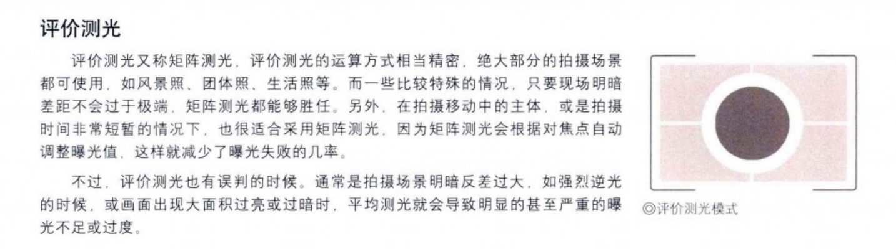
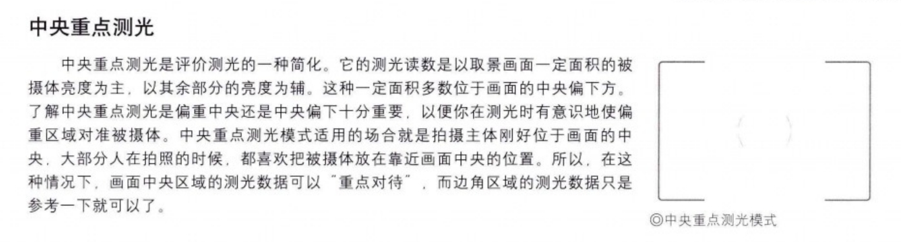
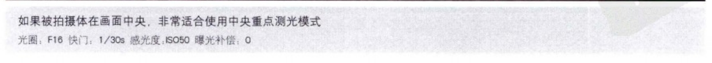
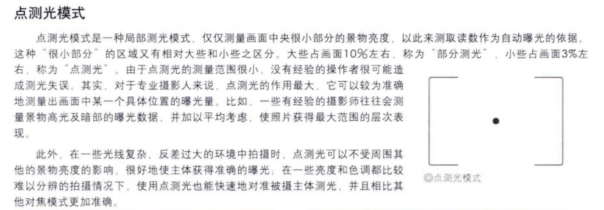
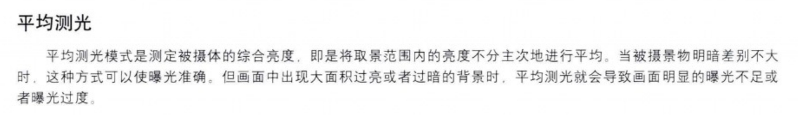

1.评价测光（矩阵测光）：

2.中央重点测光：

3.点测光：

4.平均测光：

相机的成像原理是小孔成像，物体会吸收和反射阳光，没被吸收而反射出来的就是物体的颜色，黑色的反色率大概是3-10%，白色的反射率大概是 80%-90%。
相机的对画面的曝光是以过平均反射率18%来作为参照的，测光的时候反射率高于这个值相机会将画面调暗，低于这个值会调亮。
应用：在评价测光时，雪地画面会比实际暗，雪地中的人物也就会变暗，因为曝光度降低了，相反在黑色背景人物会变亮。也就是我们可以在不同的测光模式下，用背景来测光，然后通过调节背景（测光主体）的明暗间接调节被摄主体的明暗。
例子：逆光人像，使用评价测光，将背景调暗，那么人物的脸无需补光也很亮。
在点测光的情况下则不同，因为被摄主体是人物的脸，测光测的就是脸部，脸部的曝光会是正常的