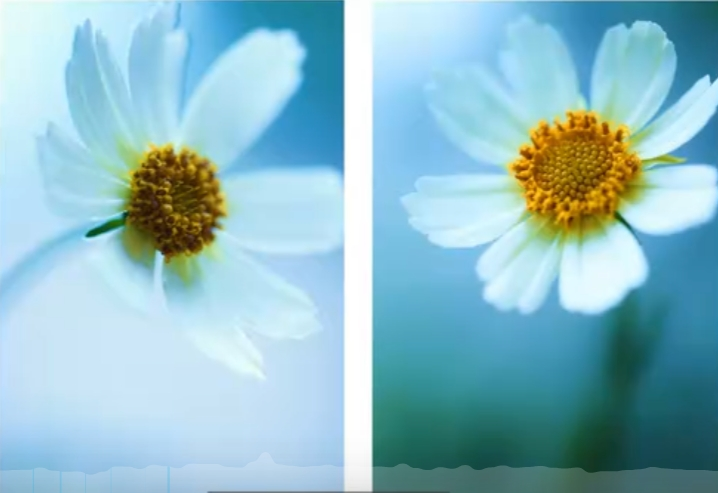
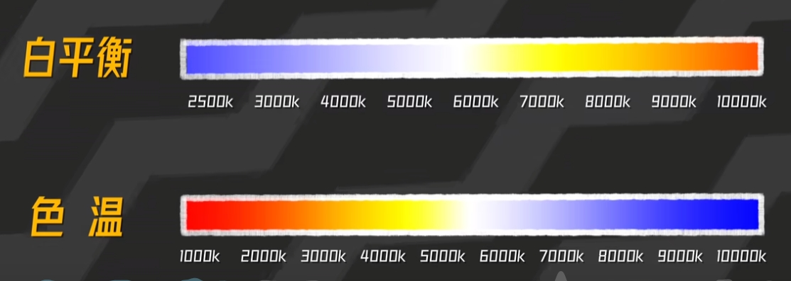
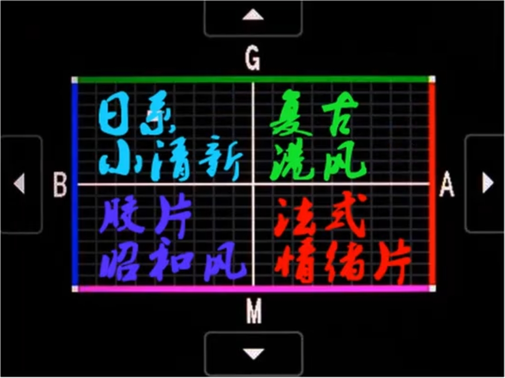
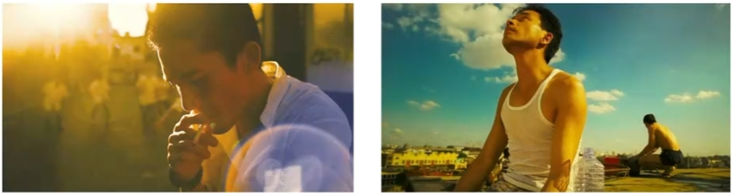
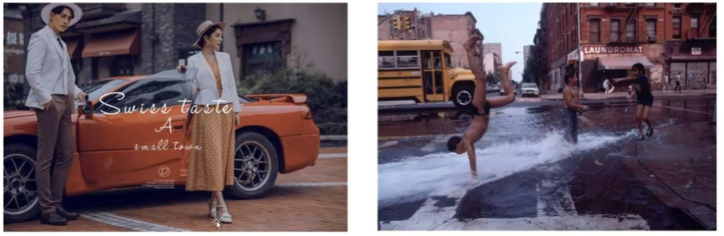
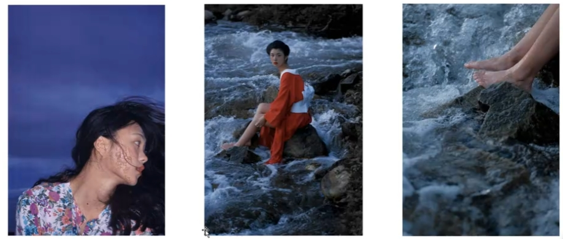

# 白平衡的应用

**一般用于色彩统一的画面**

---

**白平衡数值与白平衡偏移的区别：**
1. 白平衡数值
   + 定义: 表示色温的数值，通常以开尔文（Kelvin, K）为单位，用于调节画面的整体色彩倾向。
   + 作用: 控制画面整体的冷暖色调。
       + 低色温（如2500K-4000K）偏向蓝色或冷调，适合调整为夜景或阴影环境的冷色调。
       + 高色温（如5000K-9000K）偏向黄色或暖调，适合调整为日出、日落等温暖环境的色彩。
   + 使用场景:
       + 根据拍摄环境的光源色温（如日光、阴影、白炽灯等）调整画面的冷暖，达到色彩还原的效果。
       + 创意用途，比如人为增加暖色调以营造温馨感

2. 白平衡偏移
   + 定义: 在白平衡基础上，用于微调画面的色彩偏向，通常以两个轴来表示：
       + G-M 轴: 绿色（Green）到洋红（Magenta）的色彩偏移。
       + A-B 轴: 蓝色（Blue）到琥珀色（Amber）的色彩偏移。
   + 作用:
       + 修正因光源、相机或环境产生的细微色偏。
       + 增加更精确的色彩控制，比如避免某些区域过绿或过紫。
   + 使用场景:
       + 摄影时，针对复杂光源或人像皮肤色调进行精细调整。
       + 矫正自动白平衡未能准确调整的画面细节。

3. 例子:
    + 白平衡数值调整
      + 如果拍摄场景在白炽灯下（偏黄光），可以调低白平衡数值（如4000K），使画面更自然。
    
    + 白平衡偏移调整
      + 如果人像拍摄中皮肤略显偏绿，可以通过 G-M 轴增加洋红色调来修正皮肤颜色。
    两者配合使用可以在摄影和后期中实现精确的色彩控制。
---

## 适合使用白平衡的场景

### 1. 背景虚化，突出主体
  

---
### 2. 调节色温

色温越高，颜色越冷，越低颜色越暖

白平衡常用数值：
晴天户外：5600k
阴天：5600k - 6000k
室内白光：5500k - 6000k
室内暖光： 3500k - 4200k

---
### 3. 人像摄影

#### 人像常用风格（注意人物肤色正常）

---

### 示例

#### 1. 港风（暖色调，色温高一点）

#### 2. 法式（冷调，色温低一点）

#### 3. 昭和（冷调，色温低一点）

#### 4. 小清新（冷调，色温微微低一点）

---

## 不适合使用白平衡的场景

**当画面中色彩过多时：**  

