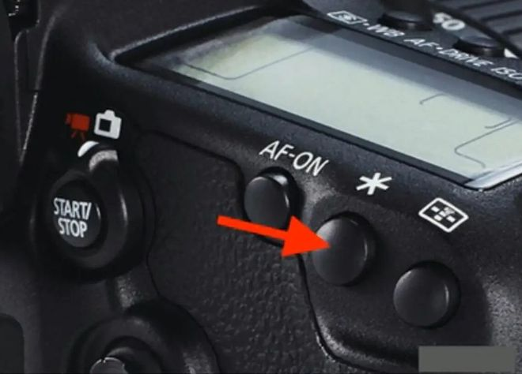

什么情况下使用曝光锁定:大光比场景
相机对着画面不同区域的亮度挪动镜头时，曝光组合数值也跟着发生变化，也就是说相机在时时刻刻对它看到的区域进行测光，以及曝光参数的调整 。
一个大光比的场景，太阳亮的地方特别亮，而暗部阴影的地方特别暗，这个时候我们对不同的地方进行测光拍摄，会得到不同的拍摄结果；但如果我们想要得到图中的效果，亮部还是亮部，暗部还是暗部的话，首先要找到测光点，也就是找到画面中偏向中间亮度的区域进行测光（蓝色箭头的地方）。

佳能相机的曝光锁定功能按键在机身背面右上角（*号键），其他品牌的相机，曝光锁定功能按键基本上都是英文的缩写字母“AE-L ”或“AEL ”，
